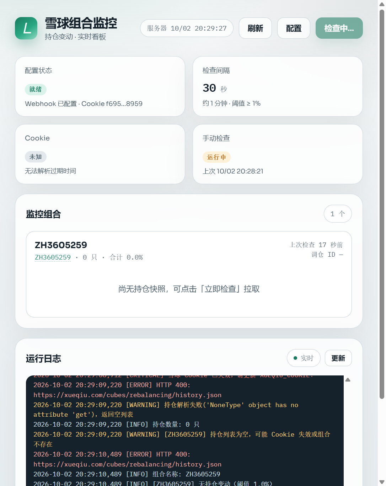
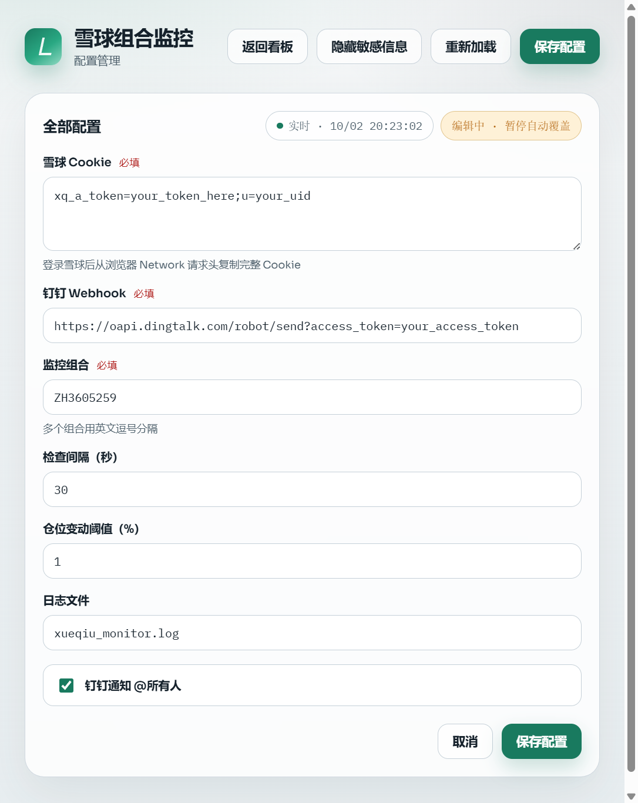

# 雪球组合监控 · 钉钉通知

> 定时监控雪球（xueqiu.com）模拟组合持仓变动，有变动时通过钉钉机器人推送通知；并提供 Web 控制台查看持仓、日志与在线配置。

**当前版本**：v2.3 | **更新时间**：2026-10-02

<p align="center">
  
</p>

---

## 界面预览

### 实时看板



### 配置页



---

## 功能特性

### 监控能力
- **自动轮询** — 内置定时循环，无需额外调度器
- **交易时段智能调度** — 盘中正常间隔、收盘前加速、休市/周末降频
- **仓位变动检测** — 基于本地持仓快照对比，避免重复触发
- **防重复推送（双重）** — 调仓记录 ID 比对 + 60 秒冷却期
- **钉钉同步展示** — 成功推送钉钉的持仓变动会实时出现在看板「持仓变动」区
- **现金比例** — 通知与看板展示持仓合计 / 现金未分配
- **三接口级联降级** — 主接口 → v5 备用 → history 降级
- **Token 过期预警** — 过期前 1 天钉钉提醒；看板展示获取时间 / 剩余有效期
- **钉钉 Markdown 通知** — 支持 @个人 或 @所有人
- **状态持久化** — `monitor_state.json` 保存快照，重启不丢失

### Web 控制台
- **一键启动** — 后台监控 + 前端页面同时启动，默认打开浏览器
- **实时看板** — 概览、持仓权重、运行日志每秒刷新
- **多组合切换** — Tab 切换当前跟踪组合；变动列表按选中组合过滤
- **查询原组合** — 实时拉取雪球净值 / 涨跌 / 持仓，并刷新本地快照
- **在线配置** — 全部配置可在页面编辑，写入 `.env` 并立即生效
- **一键登录雪球** — 打开浏览器手动登录后自动抓取完整 Cookie（需含 `xq_a_token` + `u`）并校验通过后写入
- **手动检查** — 一键触发一轮持仓检查
- **日志清空** — 运行日志面板支持一键清空
- **组合外链** — 点击组合代码跳转雪球页面

---

## 快速开始

### 1. 安装依赖

```bash
pip install -r requirements.txt
playwright install chromium
```

> `playwright` 仅在使用「登录雪球获取 Cookie」时需要。

### 2. 配置 `.env`

复制模板并填写真实值：

```bash
copy .env.example .env
```

必填项：

```env
XUEQIU_COOKIE=xq_a_token=你的token; u=你的uid
DINGTALK_WEBHOOK=https://oapi.dingtalk.com/robot/send?access_token=你的access_token
MONITORED_CUBES=ZH123456,ZH654321
```

也可启动后打开配置页在线填写，或点击「登录雪球获取 Cookie」。

> **重要**：Cookie 必须同时包含 `xq_a_token` 与用户标识 `u`。只有 token、缺少 `u` 时雪球会返回 `400016`（看起来像 Cookie 失效）。

### 3. 一键启动（推荐）

```bash
python web_app.py
```

或双击 `start.bat`。

启动后会：
1. 开启定时监控后台  
2. 启动 Web 控制台  
3. 自动打开浏览器访问 [http://127.0.0.1:8080](http://127.0.0.1:8080)

| 页面 | 地址 |
|------|------|
| 实时看板 | http://127.0.0.1:8080/ |
| 配置管理 | http://127.0.0.1:8080/config |

可选环境变量：

| 变量 | 默认 | 说明 |
|------|------|------|
| `WEB_HOST` | `127.0.0.1` | 监听地址 |
| `WEB_PORT` | `8080` | 端口 |
| `OPEN_BROWSER` | `true` | 是否自动打开浏览器 |
| `START_MONITOR` | `true` | 是否启动后台监控线程 |

仅跑监控脚本（无网页）：

```bash
python xueqiu_monitor.py
```

---

## 配置说明

| 配置项 | 默认值 | 说明 |
|--------|--------|------|
| `XUEQIU_COOKIE` | — | 雪球登录 Cookie（必填，需含 `xq_a_token` 与 `u`） |
| `DINGTALK_WEBHOOK` | — | 钉钉机器人 Webhook（必填） |
| `MONITORED_CUBES` | — | 组合代码，多个用英文逗号分隔（必填） |
| `CHECK_INTERVAL` | `300` | 交易时段检查间隔（秒） |
| `WEIGHT_CHANGE_THRESHOLD` | `1.0` | 仓位变动阈值（%） |
| `AT_ALL` | `false` | 是否 @所有人 |
| `LOG_FILE` | `xueqiu_monitor.log` | 日志文件路径 |
| `TRADING_HOURS_ONLY` | `true` | 启用交易时段智能调度 |
| `OFF_HOURS_INTERVAL` | `1800` | 休市/周末检查间隔（秒） |
| `PRE_CLOSE_MINUTES` | `15` | 收盘前加速窗口（分钟） |
| `PRE_CLOSE_INTERVAL` | `60` | 收盘前检查间隔（秒） |
| `MARKET_CLOSE` | `15:00` | 下午收盘时间（含港股可设 16:00） |

> 前端配置页修改后会同步写入 `.env`。若单独运行 `xueqiu_monitor.py`，需重启该进程才能读到新配置。

---

## Token 获取

### 方式一：配置页一键登录（推荐）

1. 打开 [配置页](http://127.0.0.1:8080/config)
2. 点击「登录雪球获取 Cookie」
3. 在弹出的浏览器中完成登录（账号密码 / 短信 / 扫码均可）
4. 程序自动校验（字段完整 + 接口可用）后写入 `.env`

看板 Cookie 卡片会显示 **获取时间**（来自 `xq_id_token` 签发时间）与剩余有效期。

### 方式二：手动复制

1. 浏览器登录 [https://xueqiu.com](https://xueqiu.com)
2. 按 `F12` → **Network** → 刷新页面，点任意请求
3. 在 **Request Headers** 中复制完整 `Cookie`（务必包含 `xq_a_token` 与 `u`）
4. 粘贴到 `.env` 或配置页

> Cookie 有时效性；脚本会在过期前 1 天发送钉钉提醒。

### 钉钉 Webhook

1. 钉钉群 → 群设置 → 智能群助手 → 添加机器人  
2. 选择「自定义」机器人  
3. 安全设置选「关键词」，填入 `雪球`  
4. 复制 Webhook URL

---

## 通知效果

### 持仓变动通知

```markdown
## 📈 组合名称 持仓变动
> 组合代码：ZH123456　｜　检测时间：04/28 23:30

### 📋 变动明细
- 📈 **加仓** 贵州茅台（SH600519）：25.0% → **28.5%**（+3.5%）  当前价 ¥1680.00
- 🔴 **卖出** 中国平安（SH601318）：清仓（原仓位 10.0%）
```

### Token 过期预警

```markdown
## ⚠️ 雪球 Cookie 即将过期

> 过期时间：**2026-06-15 14:30**
> 剩余：**12.5 小时**

请及时更新 `.env` 文件中的 `XUEQIU_COOKIE`，否则监控将失效。
```

---

## 文件结构

```
xueqiu_monitor/
├── start.bat              # 一键启动（后台 + 前端）
├── web_app.py             # Web 控制台 + 后台监控入口
├── xueqiu_monitor.py      # 纯监控脚本（无网页）
├── xueqiu_login.py        # Playwright 登录抓取 Cookie
├── web/                   # 前端静态资源
│   ├── index.html         # 实时看板
│   ├── config.html        # 配置页
│   ├── style.css
│   ├── app.js
│   ├── config.js
│   └── favicon.png        # 站点图标
├── docs/                  # README 配图
│   ├── dashboard.png
│   ├── config.png
│   └── favicon.png
├── .env                   # 本地配置（勿提交）
├── .env.example           # 配置模板
├── requirements.txt
├── monitor_state.json     # 持仓快照（自动生成）
└── xueqiu_monitor.log     # 运行日志（自动生成）
```

---

## Web API（控制台）

| 方法 | 路径 | 说明 |
|------|------|------|
| GET | `/api/status` | 监控概览、持仓快照、最近变动、Token 获取时间 |
| GET | `/api/changes` | 持仓变动历史（与钉钉已推送同步） |
| GET | `/api/cubes` | 监控组合列表（本地快照） |
| GET | `/api/cubes/{id}` | 单个组合本地快照 |
| GET | `/api/cubes/{id}/live` | 实时查询雪球原组合行情与持仓，并刷新快照 |
| POST | `/api/xueqiu/login/start` | 打开浏览器登录雪球并自动抓 Cookie |
| GET | `/api/xueqiu/login/status` | 登录抓取进度 |
| POST | `/api/xueqiu/login/cancel` | 取消登录 |
| GET / PUT | `/api/config` | 读取 / 保存配置 |
| GET | `/api/logs` | 最近日志 |
| POST | `/api/logs/clear` | 清空日志文件 |
| POST | `/api/check` | 手动触发一轮检查 |
| GET | `/api/health` | 健康检查 |

---

## 雪球数据接口

| 优先级 | 接口 | 说明 |
|--------|------|------|
| 1 | `/cubes/rebalancing/current.json` | 最新持仓（主接口） |
| 2 | `/v5/cube/rebalancing/current.json` | v5 备用 |
| 3 | `/cubes/rebalancing/history.json` | 调仓历史（降级兜底） |
| — | `/cubes/quote.json` | 原组合净值 / 涨跌摘要（看板「查询原组合」） |

> 客户端通过 Cookie Jar 携带登录态（勿把整段 Cookie 塞进 `headers['Cookie']`，否则易被判定未登录并返回 `400016`）。

---

## 常见问题

**Q: 报 `400016` / CRITICAL Cookie 已失效？**  
A: 常见原因有两种：  
1. Cookie 不完整（只有 `xq_a_token`，缺少 `u`）→ 用配置页「登录雪球」重新获取完整 Cookie  
2. Cookie 确实过期 → 重新登录后更新  

**Q: 报 403/401？**  
A: 优先检查 Cookie 是否完整有效。`stock.xueqiu.com` 的偶发 403 多为风控，客户端会自动降级到其他接口。

**Q: 报 404？**  
A: 组合代码错误，或不存在 / 非公开组合。

**Q: 持仓列表为空？**  
A: 可能是私密组合、Cookie 无权限，或接口临时异常。可点看板「查询原组合」强制从雪球拉取；仍失败则查看运行日志。

**Q: 通知没收到？**  
A: 确认钉钉机器人关键词包含「雪球」。

**Q: 同时监控多个组合？**  
```env
MONITORED_CUBES=ZH123456,ZH654321,ZH111111
```
看板顶部可用 Tab 切换组合；「持仓变动」会按当前选中组合过滤。

**Q: 前端开了，监控也在跑吗？**  
A: 使用 `python web_app.py` / `start.bat` 时默认同时启动后台监控线程。

**Q: 不想自动打开浏览器？**  
```bash
set OPEN_BROWSER=false
python web_app.py
```

---

## 停止

```bash
# 在运行窗口按 Ctrl+C
```

---

## License

MIT
